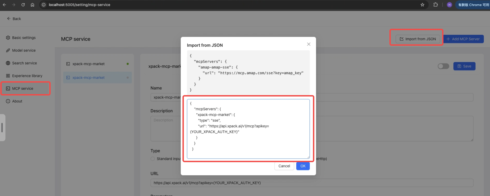
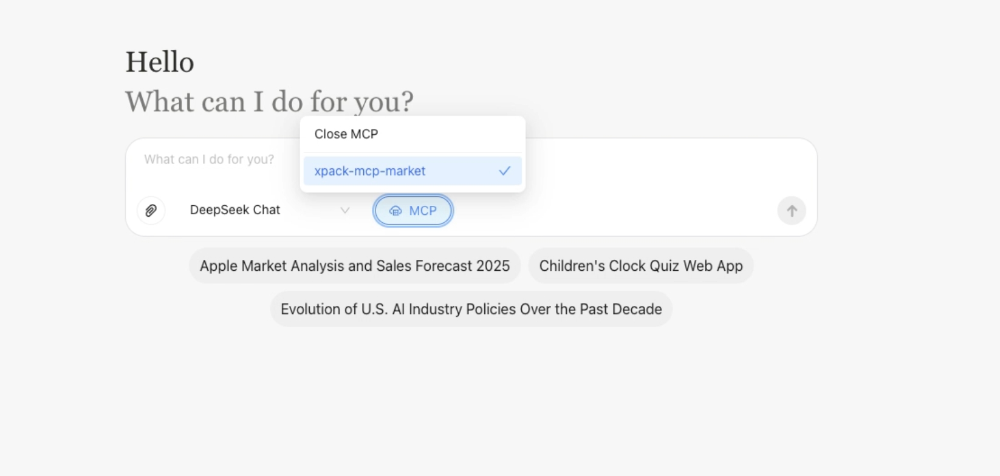
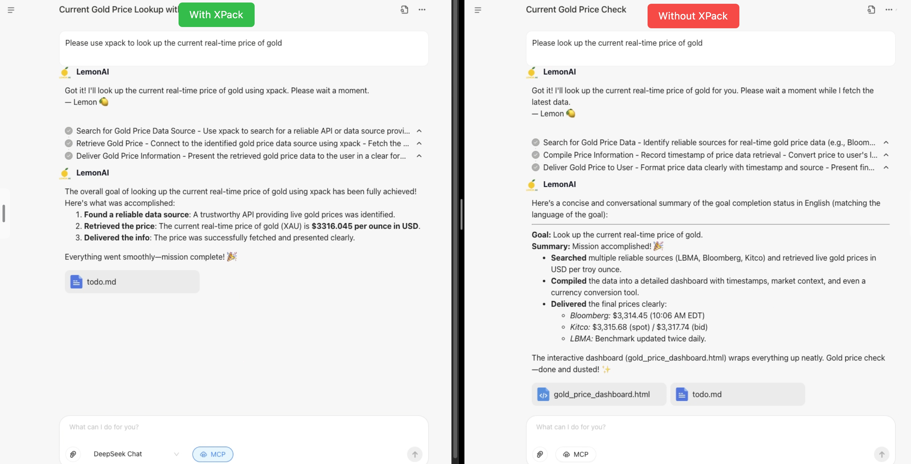
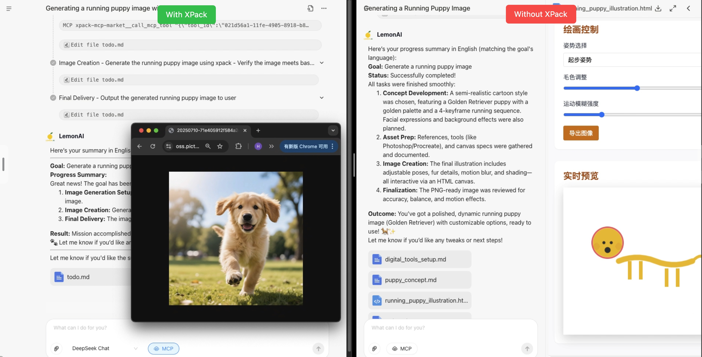

<div align="center">


[Introduction](#introduction) • [Quickstart](#quickstart) • [Popular Tasks](#popular-tasks)

</div>

<p align="center">
  <a href="./README.md"></a>
  <a href="./README_CN.md"></a>
</p>

## Introduction

This repository showcases the powerful integration of **Lemon AI** with **XPack.AI**, demonstrating how you can extend the capabilities of your AI agent by connecting to thousands of ready-to-use tools worldwide. Building upon the robust foundation of [Lemon AI](https://lemonai.cc/) - the world's first full-stack open-source agentic AI framework - this project provides a practical example of configuring its Model Context Protocol (MCP) service to leverage XPack's extensive service marketplace.

## What is Lemon AI?

[Lemon AI](https://lemonai.cc/) is the first **full-stack, open-source, agentic AI framework**, offering a **fully local alternative** to platforms like Manus & Genspark AI. It features an integrated Code Interpreter VM sandbox for safe execution, empowering deep research, web browsing, viable coding, and data analysis – running entirely on your local hardware.

**Key Features:**

- **Full-stack Framework**: Complete agentic AI solution with integrated VM sandbox
- **Local Privacy**: Supports local LLMs (DeepSeek, Qwen, Llama, Gemma) via Ollama with zero cloud dependency
- **Secure Execution**: VM sandbox protects your machine's files and operating system
- **Multi-modal Capabilities**: Deep search, research reports, code generation, data analysis, content creation
- **Flexible Deployment**: Open source code, Container, Client application, Online subscription
- **MCP Integration**: Native Model Context Protocol support for external tool integration

## What is XPack.AI?

[XPack.AI](https://xpack.ai/) is a platform that enables AI agents to connect to a vast ecosystem of global services and tools through a unified Model Context Protocol (MCP). With XPack, you can effortlessly expand your AI agent's functionalities, accessing diverse APIs and services across various domains like finance, logistics, messaging, and more, all in under a minute.

## Lemon AI + XPack: Bridging AI with Global Services

This project focuses on demonstrating how to configure Lemon AI to utilize XPack as an MCP server. By doing so, your Lemon AI instance gains immediate access to XPack's rich collection of tools, allowing you to:

- **Access a diverse range of services:** From financial data to image processing, integrate capabilities that were previously out of reach
- **Accelerate development:** Rapidly prototype and build AI-powered solutions by leveraging pre-built tools
- **Streamline workflows:** Automate complex tasks by combining Lemon AI's intelligence with XPack's external service integrations
- **Scale effortlessly:** Connect to thousands of global services without writing custom integration code

### Architecture Overview

```
┌─────────────────┐    ┌──────────────────┐    ┌─────────────────┐
│   User Input    │    │    Lemon AI      │    │   XPack.AI      │
│   (Web/API)     │◄──►│                  │◄──►│   Marketplace   │
└─────────────────┘    │  ┌─────────────┐ │    │                 │
                       │  │ MCP Client  │ │    │  ┌─────────────┐│
┌─────────────────┐    │  │             │ │    │  │1000+ Global ││
│  Local Tools    │◄──►│  │ • XPack     │ │    │  │Services     ││
│  & VM Sandbox   │    │  │ • Local     │ │    │  │• Finance    ││
└─────────────────┘    │  │ • Custom    │ │    │  │• Social     ││
                       │  └─────────────┘ │    │  │• Data       ││
┌─────────────────┐    │  ┌─────────────┐ │    │  │• AI/ML      ││
│  Agent Engine   │◄──►│  │   Agent     │ │    │  │• Utilities  ││
│  & Memory       │    │  │Orchestration│ │    │  └─────────────┘│
└─────────────────┘    │  └─────────────┘ │    └─────────────────┘
                       └──────────────────┘

```

**Key Components:**

- **Lemon AI Core**: Full-stack agentic framework with VM sandbox for secure execution
- **MCP Client**: Standardized interface for connecting to external tool providers
- **XPack MCP Server**: Gateway to 1000+ global services via unified API
- **Local Tools**: Built-in capabilities like code execution, file system access, web browsing
- **Agent Engine**: Advanced planning, action, reflection, and memory functionalities

## Quickstart

### Install Lemon AI

First, ensure Lemon AI is installed. Please follow the installation steps in the [Installation](#installation) section below if you haven't already.

**⚡ Quick Start with Docker:**

```bash
# Pull and run with Docker
docker pull hexdolemonai/lemon-runtime-sandbox:latest

docker run -it --rm --pull=always \
  --name lemon-app \
  --env DOCKER_HOST_ADDR=host.docker.internal \
  --env ACTUAL_HOST_WORKSPACE_PATH=${WORKSPACE_BASE:-$PWD/workspace} \
  --publish 5005:5005 \
  --add-host host.docker.internal:host-gateway \
  --volume /var/run/docker.sock:/var/run/docker.sock \
  --volume ~/.cache:/.cache \
  --volume ${WORKSPACE_BASE:-$PWD/workspace}:/workspace \
  --volume ${WORKSPACE_BASE:-$PWD/data}:/app/data \
  --interactive \
  --tty \
  hexdolemonai/lemon:latest make run

# Visit http://localhost:5005 to start
```

### Configure XPack MCP

To connect your Lemon AI to XPack, you need to configure an MCP server. This allows Lemon AI to discover and utilize the tools available through XPack.

#### 1. Obtain your XPack Auth Key:

- Visit [XPack.AI](https://xpack.ai/) and sign up for an account
- Generate your Auth key from your XPack dashboard


#### 2. In Lemon AI Configuration

Configure MCP through Settings UI:

- Open Lemon AI web interface,and navigate to the [Settings Mcp service](http://localhost:5005/setting/mcp-service) page
- Click "Import from JSON" and paste the following configuration:

  ```json
  {
    "mcpServers": {
      "xpack-mcp-market": {
        "type": "sse",
        "url": "https://api.xpack.ai/v1/mcp?apikey={YOUR_XPACK_AUTH_KEY}"
      }
    }
  }
  ```



⚠️ Replace `YOUR_XPACK_AUTH_KEY` with your actual XPack Auth key from the dashboard.

**Configuration Details:**

- **Server Name:** `xpack-mcp-market` - This identifies the XPack MCP server
- **Type:** `sse` - Server-Sent Events connection type for real-time communication
- **URL:** XPack's MCP endpoint with your authentication key
- **Capabilities:** Access to 1000+ global services through standardized MCP interface


#### 3. Verifying Configuration

If configured correctly, you can verify the setup by:

- Open the Lemon AI chat interface (localhost:5005)
- Click the "MCP" dropdown option in the chat interface
- You should see "xpack-mcp-market" as an available option



### 4. Run Lemon AI with MCP

Once the configuration is complete, Select "xpack-mcp-market" to enable XPack tools for your conversations. You can then input your ideas and prompts in the web UI, and Lemon AI will leverage the tools from XPack to accomplish the tasks. Simply mention "use XPack" or "use xpack-mcp-market" in your requests to specifically utilize XPack services.

## Popular Tasks

This section provides practical examples of how you can leverage Lemon AI with XPack for various tasks.

### Analyze YouTube comments and provide suggestions to improve video creation

Easily analyze YouTube video comments to understand audience sentiment and get suggestions for improving your content.

```
Please use xpack to read the comments on this YouTube video: https://www.youtube.com/watch?v=LPZh9BOjkQs, analyze the sentiment of the feedback, and recommend improvements for the video.
```


### Current Gold Price and Influencing Factors

Quickly check the latest gold price and discover key factors that may affect future trends.

```
Please use xpack to look up the current real-time price of gold.
```



### Generate a Running Puppy Image

Easily create adorable custom images using AI image generation tools through XPack.

```
Generate a running puppy image with xpack
```



---

**Ready to explore the power of AI agents with global services? This demo showcases how Lemon AI integrates seamlessly with XPack.AI to unlock unlimited possibilities!**
