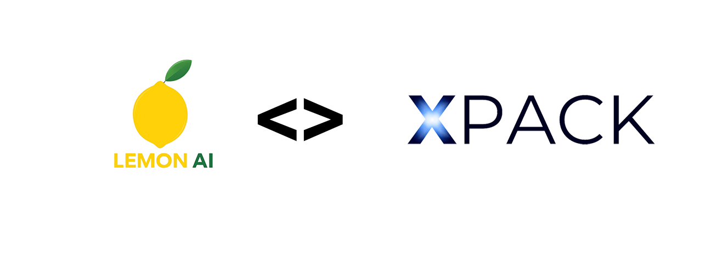
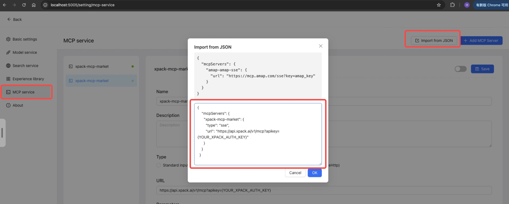
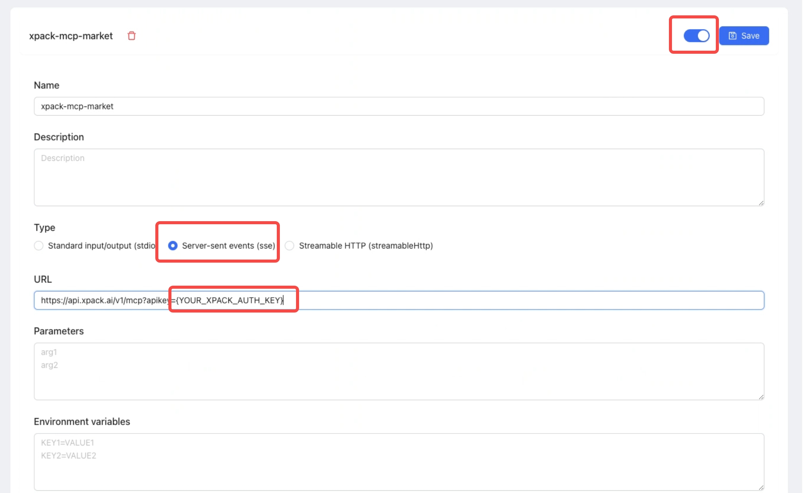
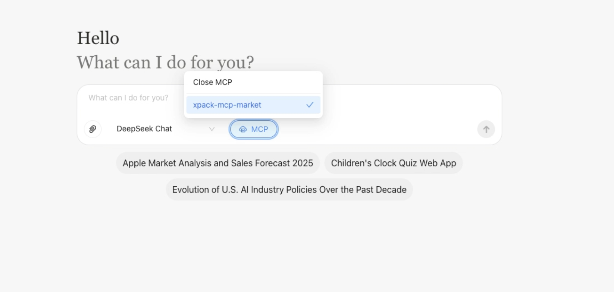
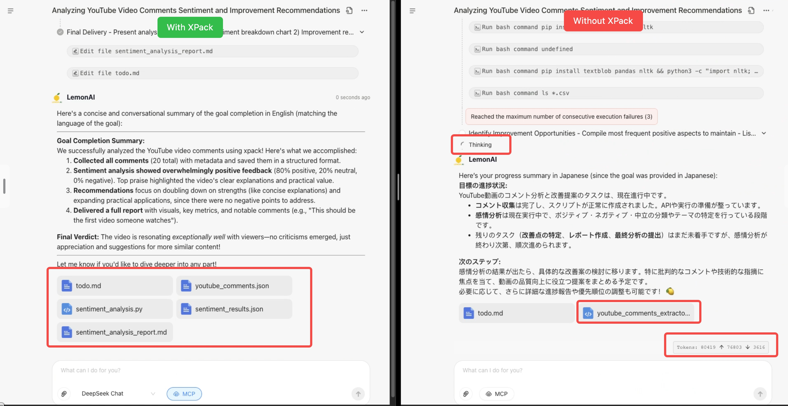
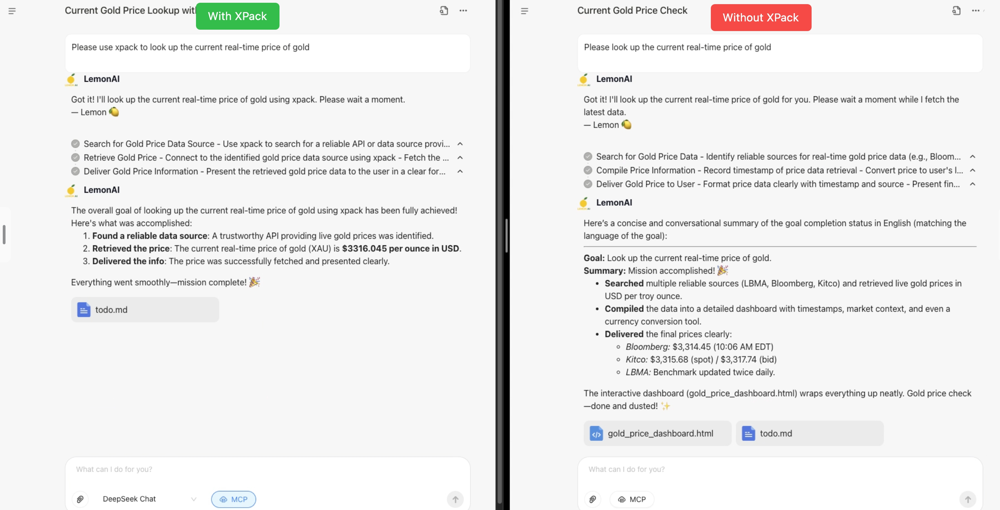
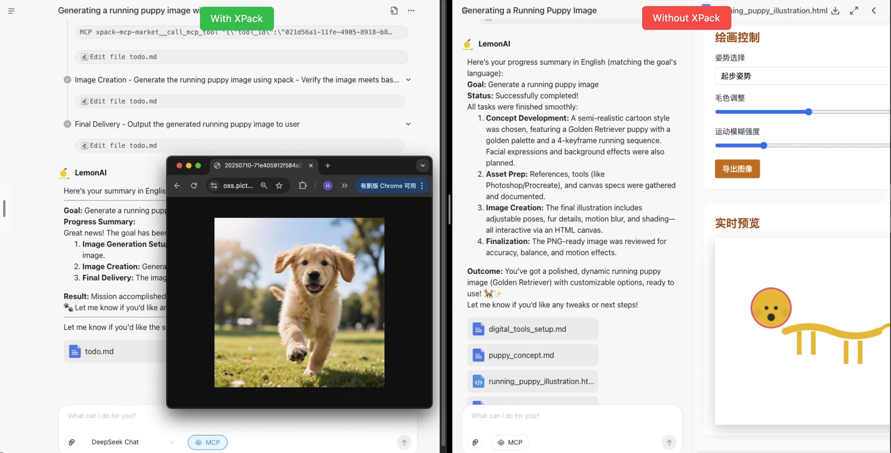

<div align="center">



[介绍](#介绍) • [快速开始](#快速开始) • [热门任务](#热门任务)

</div>

<p align="center">
  <a href="./README.md"></a>
  <a href="./README_CN.md"></a>
</p>

## 介绍

本仓库展示了 **Lemon AI** 与 **XPack.AI** 的强大集成，演示了如何通过连接全球数千个即用型工具来扩展您的 AI 代理能力。基于 [Lemon AI](https://lemonai.cc/) 的强大基础 - 世界首个全栈开源代理式 AI 框架 - 本项目提供了配置其模型上下文协议 (MCP) 服务以利用 XPack 广泛服务市场的实际示例。

## 什么是 Lemon AI？

[Lemon AI](https://lemonai.cc/) 是首个**全栈、开源、代理式 AI 框架**，为 Manus & Genspark AI 等平台提供**完全本地化的替代方案**。它具有集成的代码解释器虚拟机沙箱，可安全执行，支持深度研究、网页浏览、可行编码和数据分析 - 完全在您的本地硬件上运行。

**主要特性：**

- **全栈框架**：具有集成虚拟机沙箱的完整代理式 AI 解决方案
- **本地隐私**：通过 Ollama 支持本地 LLM（DeepSeek、Qwen、Llama、Gemma），零云依赖
- **安全执行**：虚拟机沙箱保护您机器的文件和操作系统
- **多模态能力**：深度搜索、研究报告、代码生成、数据分析、内容创作
- **灵活部署**：开源代码、容器、客户端应用程序、在线订阅
- **MCP 集成**：原生模型上下文协议支持外部工具集成

## 什么是 XPack.AI？

[XPack.AI](https://xpack.ai/) 是一个平台，使 AI 代理能够通过统一的模型上下文协议 (MCP) 连接到庞大的全球服务和工具生态系统。使用 XPack，您可以轻松扩展 AI 代理的功能，访问金融、物流、消息传递等各个领域的多样化 API 和服务，所有这些都可以在一分钟内完成。

## Lemon AI + XPack：连接 AI 与全球服务

本项目专注于演示如何配置 Lemon AI 以利用 XPack 作为 MCP 服务器。通过这样做，您的 Lemon AI 实例可以立即访问 XPack 丰富的工具集合，使您能够：

- **访问多样化的服务范围：** 从金融数据到图像处理，集成以前无法触及的功能
- **加速开发：** 通过利用预构建工具快速原型化和构建 AI 驱动的解决方案
- **简化工作流程：** 通过结合 Lemon AI 的智能与 XPack 的外部服务集成来自动化复杂任务
- **轻松扩展：** 连接到数千个全球服务，无需编写自定义集成代码

### 架构概览

```
┌─────────────────┐    ┌──────────────────┐    ┌─────────────────┐
│   User Input    │    │    Lemon AI      │    │   XPack.AI      │
│   (Web/API)     │◄──►│                  │◄──►│   Marketplace   │
└─────────────────┘    │  ┌─────────────┐ │    │                 │
                       │  │ MCP Client  │ │    │  ┌─────────────┐│
┌─────────────────┐    │  │             │ │    │  │1000+ Global ││
│  Local Tools    │◄──►│  │ • XPack     │ │    │  │Services     ││
│  & VM Sandbox   │    │  │ • Local     │ │    │  │• Finance    ││
└─────────────────┘    │  │ • Custom    │ │    │  │• Social     ││
                       │  └─────────────┘ │    │  │• Data       ││
┌─────────────────┐    │  ┌─────────────┐ │    │  │• AI/ML      ││
│  Agent Engine   │◄──►│  │   Agent     │ │    │  │• Utilities  ││
│  & Memory       │    │  │Orchestration│ │    │  └─────────────┘│
└─────────────────┘    │  └─────────────┘ │    └─────────────────┘
                       └──────────────────┘

```

**关键组件：**

- **Lemon AI 核心**：具有虚拟机沙箱的全栈代理式框架，用于安全执行
- **MCP 客户端**：连接外部工具提供商的标准化接口
- **XPack MCP 服务器**：通过统一 API 访问 1000+ 全球服务的网关
- **本地工具**：内置功能，如代码执行、文件系统访问、网页浏览
- **代理引擎**：高级规划、行动、反思和记忆功能

## 快速开始

### 安装 Lemon AI

首先，确保已安装 Lemon AI。如果您尚未安装，请按照下面[安装](#安装)部分的安装步骤进行操作。

**⚡ Docker 快速开始：**

```bash
# 使用 Docker 拉取并运行
docker pull hexdolemonai/lemon-runtime-sandbox:latest

docker run -it --rm --pull=always \
  --name lemon-app \
  --env DOCKER_HOST_ADDR=host.docker.internal \
  --env ACTUAL_HOST_WORKSPACE_PATH=${WORKSPACE_BASE:-$PWD/workspace} \
  --publish 5005:5005 \
  --add-host host.docker.internal:host-gateway \
  --volume /var/run/docker.sock:/var/run/docker.sock \
  --volume ~/.cache:/.cache \
  --volume ${WORKSPACE_BASE:-$PWD/workspace}:/workspace \
  --volume ${WORKSPACE_BASE:-$PWD/data}:/app/data \
  --interactive \
  --tty \
  hexdolemonai/lemon:latest make run

# 访问 http://localhost:5005 开始使用
```

### 配置 XPack MCP

要将您的 Lemon AI 连接到 XPack，您需要配置一个 MCP 服务器。这允许 Lemon AI 发现并利用通过 XPack 提供的工具。

#### 1. 获取您的 XPack 认证密钥：

- 访问 [XPack.AI](https://xpack.ai/) 并注册账户
- 从您的 XPack 仪表板生成认证密钥


#### 2. 在 Lemon AI 配置中

通过设置 UI 配置 MCP：

- 打开 Lemon AI 网页界面，导航到 [设置 MCP 服务](http://localhost:5005/setting/mcp-service) 页面
- 点击"从 JSON 导入"并粘贴以下配置：

  ```json
  {
    "mcpServers": {
      "xpack-mcp-market": {
        "type": "sse",
        "url": "https://api.xpack.ai/v1/mcp?apikey={YOUR_XPACK_AUTH_KEY}"
      }
    }
  }
  ```



⚠️ 将 `YOUR_XPACK_AUTH_KEY` 替换为您从仪表板获得的实际 XPack 认证密钥。

**配置详情：**

- **服务器名称：** `xpack-mcp-market` - 这标识 XPack MCP 服务器
- **类型：** `sse` - 用于实时通信的服务器发送事件连接类型
- **URL：** 带有您的认证密钥的 XPack MCP 端点
- **功能：** 通过标准化 MCP 接口访问 1000+ 全球服务



#### 3. 验证配置

如果配置正确，您可以通过以下方式验证设置：

- 打开 Lemon AI 聊天界面 (localhost:5005)
- 在聊天界面中点击"MCP"下拉选项
- 您应该看到"xpack-mcp-market"作为可用选项



### 4. 使用 MCP 运行 Lemon AI

配置完成后，选择"xpack-mcp-market"为您的对话启用 XPack 工具。然后您可以在网页 UI 中输入您的想法和提示，Lemon AI 将利用 XPack 的工具来完成任务。只需在您的请求中提及"使用 XPack"或"使用 xpack-mcp-market"即可专门利用 XPack 服务。

## 热门任务

本节提供了如何利用 Lemon AI 与 XPack 执行各种任务的实际示例。

### 分析 YouTube 评论并提供改进视频创作的建议

轻松分析 YouTube 视频评论以了解观众情绪并获得改进内容的建议。

```
Please use xpack to read the comments on this YouTube video: https://www.youtube.com/watch?v=LPZh9BOjkQs, analyze the sentiment of the feedback, and recommend improvements for the video.
```



### 当前黄金价格和影响因素

快速查看最新黄金价格并发现可能影响未来趋势的关键因素。

```
Please use xpack to look up the current real-time price of gold.
```



### 生成奔跑的小狗图片

通过 XPack 使用 AI 图像生成工具轻松创建可爱的自定义图片。

```
Generate a running puppy image with xpack
```



---

**准备好探索 AI 代理与全球服务的强大功能了吗？这个演示展示了 Lemon AI 如何与 XPack.AI 无缝集成，释放无限可能！**
