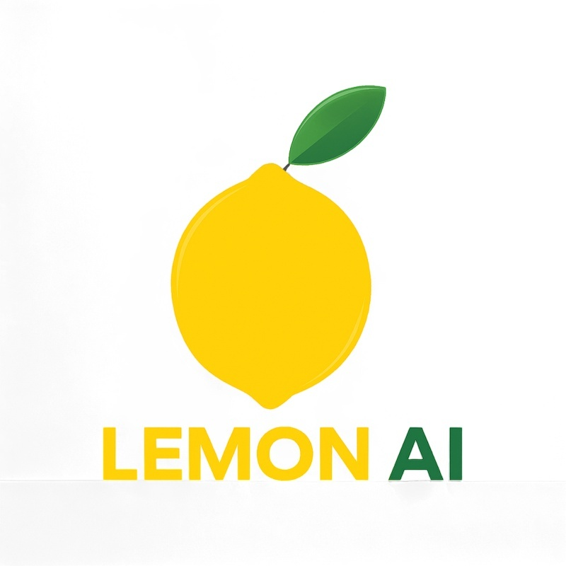

# Lemon AI 是首个全栈、开源、基于代理的 AI 框架，为 Manus & Genspark AI 等平台提供了一个完全本地化的替代方案。它具备集成的代码解释器虚拟机沙箱，以实现安全执行。

<div align=center>
  
</div>
<p align="center">
  <a href="https://lemon-11.gitbook.io/lemonai/lemon-docs">快速了解 Lemon AI</a> ·
  <a href="https://lemon-11.gitbook.io/lemonai/lemon-docs/kai-fa-bu-shu-zhi-nan/docker-kuai-su-bu-shu">Docker快速部署</a> ·
  <a href="https://lemon-11.gitbook.io/lemonai/lemon-docs">文档</a> ·
  <a href="https://www.lemonai.cc">下载macOS 和 Windows 桌面应用程序</a> ·
</p>

<p align="center">
  <a href="./README.md"></a>
  <a href="./README_CN.md"></a>
</p>

Lemon AI 是首个全栈、开源、基于代理的 AI 框架，为 Manus & Genspark AI 等平台提供了一个完全本地化的替代方案。它具备集成的代码解释器虚拟机沙箱，以实现安全执行。

Lemon AI能够进行深度研究、网页浏览、实际编码和数据分析，且完全在本地硬件上运行。它通过Ollama支持规划、行动、反思和记忆功能，所使用的本地LLMs（如DeepSeek、Qwen、Llama、Gemma）确保了完全隐私，且无需依赖云。

为了增强安全性，Lemon AI在本地虚拟机沙盒内运行。该沙盒通过安全处理所有代码编写、执行和编辑任务，来保护您的机器文件和操作系统。

此外，Lemon AI 还提供灵活性，可通过领先的云模型（如 Claude、GPT、Gemini 和 Grok）的 API 来配置增强的结果。

<a href="https://youtu.be/OmU_4rrZUHE?si=iseqOl5TV2n2kovy">
  <figure>
    
  </figure>
</a>

### 功能与特点

**全球第⼀款全栈开源的 AI Agentic 框架，多快好省，满⾜各类需求**

#### 多：无限多可能，无限多场景 
Lemon AI作为支持无限任务场景的通用 AI Agent 能力，包括：
- 深度搜索与研究报告  
- 代码生成与数据分析  
- 内容创作与文档处理  
- 支持经验库自学习及扩展企业定制化功能  

**部署方式：** 开源代码、容器、客户端应用、在线订阅 —— 兼容云端/本地/一体化系统  

#### 快：极速部署，即刻上手  
一键部署，无需复杂配置即可立即使用：
- 所有部署方式均简化安装流程  
- 无需复杂配置即可快速搭建  
- 5分钟内即可使用的系统  
- 支持从个人电脑到企业服务器的各种部署环境，配备完整文档以确保顺利实施  

#### 好：功能强大，灵活可定制
功能强大的框架，具备广泛的能力：
- 虚拟机集成  
- 代码生成与执行  
- 浏览器操作与网页搜索  
- 多工具集成  
- 高度可扩展架构，支持根据特定业务需求进行定制修改和扩展，并可与现有系统无缝集成  

#### 省：同等质量，成本降低10倍 
显著降低运营成本：
- 与其他AI Agent产品相比，Lemon AI的单次任务成本可降低10倍以上  
- 开源订阅模式  
- 基于开源 DeepSeekV3 模型  
- 在不牺牲质量和性能的前提下大幅节省成本，使各类规模组织都能轻松获取先进的 AI 能力

### 使用 Lemon

* 使用这个[入门指南](https://lemon-11.gitbook.io/lemon-docs)快速在您的环境中运行 Lemon。更多参考和详细说明请参阅我们的文档。

### 运行 Lemon

---

#### 系统要求 <a href="#system-requirements" id="system-requirements"></a>

* [支持 Docker Desktop](https://docs.docker.com/desktop/setup/install/mac-install/#system-requirements)的 MacOS
* Linux
* [支持WSL](https://learn.microsoft.com/en-us/windows/wsl/install)和[Docker Desktop 的](https://docs.docker.com/desktop/setup/install/windows-install/#system-requirements)Windows

建议使用具有现代处理器和至少**4GB RAM的系统来运行 Lemon。**

#### **MacOS**

**Docker 桌面**

1.  [在 Mac 上安装 Docker Desktop](https://docs.docker.com/desktop/setup/install/mac-install)。
2.  打开 Docker Desktop，转到`Settings > Advanced`并确保`Allow the default Docker socket to be used`已启用。

#### **Linux**

使用 Ubuntu 22.04 测试。

**Docker 桌面**

1.  [在 Linux 上安装 Docker Desktop](https://docs.docker.com/desktop/setup/install/linux/)。

#### **Windows**

**WSL**

1.  [安装 WSL](https://learn.microsoft.com/en-us/windows/wsl/install)。
2.  `wsl --version`在 powershell 中运行并确认`Default Version: 2`。

**Docker 桌面**

1.  [在 Windows 上安装 Docker Desktop](https://docs.docker.com/desktop/setup/install/windows-install)。
2.  打开Docker Desktop，前往`Settings`并确认以下内容：

    * 常规：`Use the WSL 2 based engine`已启用。
    * 资源 > WSL 集成：`Enable integration with my default WSL distro`已启用。

必须在 WSL 终端内运行以下用于启动应用程序的 docker 命令。

### 启动应用程序 <a href="#start-the-app" id="start-the-app"></a>

运行Lemon最简单的方法是使用 Docker。

```bash
docker pull hexdolemonai/lemon-runtime-sandbox:latest

docker run -it --rm --pull=always \
  --name lemon-app \
  --env DOCKER_HOST_ADDR=host.docker.internal \
  --env ACTUAL_HOST_WORKSPACE_PATH=${WORKSPACE_BASE:-$PWD/workspace} \
  --publish 5005:5005 \
  --add-host host.docker.internal:host-gateway \
  --volume /var/run/docker.sock:/var/run/docker.sock \
  --volume ~/.cache:/.cache \
  --volume ${WORKSPACE_BASE:-$PWD/workspace}:/workspace \
  --volume ${WORKSPACE_BASE:-$PWD/data}:/app/data \
  --interactive \
  --tty \
  hexdolemonai/lemon:latest make run
```

#### 贡献

对于那些想要贡献代码的人，请参阅我们的[贡献指南](https://github.com/hexdocom/lemon/blob/main/CONTRIBUTING_CN.md)。同时，请考虑通过社交媒体、活动和会议来支持 Lemon 的分享。

### 社区与支持

---

我们欢迎您为 Lemon 作出贡献，以帮助改善 Lemon。包括：提交代码、问题、新想法，或分享您基于 Lemon 创建的有趣且有用的 AI 应用程序。同时，我们也欢迎您在不同的活动、会议和社交媒体上分享 Lemon。

* [GitHub Issues](https://github.com/hexdocom/lemon/issues)。👉：使用 Lemon 时遇到的错误和问题，请参阅贡献指南
* 电子邮件支持👉：关于使用 Lemon的问题。
* [X(Twitter)](https://x.com/LemonAI_cc)。👉：分享您的应用程序并与社区交流。
* [Discord](https://discord.gg/nQVE5mBy)。👉：分享您的应用程序并与社区交流。
* 商业许可。👉：有关商业用途许可 Lemon的商业咨询。

### Star History

[](https://www.star-history.com/#hexdocom/lemonai&Date)

### 安全问题

---

为了保护您的隐私，请避免在 GitHub 上发布安全问题。发送问题至service@hexdo.com我们将为您做更进一步的解答。

### 执照

---

本仓库遵循Lemon Open Source License 协议开源，该许可证本质上是Apache 2.0，但有一些额外的限制。
